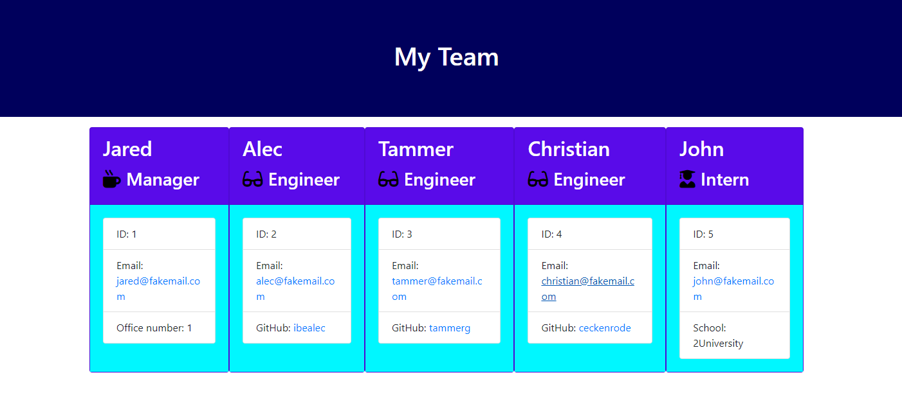

# Team-Profile-Generator

## Description
Team Generator is a node CLI that takes in information about employees and generates an HTML webpage that displays a nicely formatted summary for each person.

## Table of Contents
- [Installation Steps](#installation-steps)
- [Usage Instructions](#usage-instructions)
- [Licenses](#licenses)
- [Contribution Guidelines](#contribution-guidelines)
- [Testing Instructions](#testing-instructions)

---
## Installation 
Node.js and npm must be installed, as well as the Inquirer package. The application uses the fs module and chalk package as well.

## Usage Instructions
In order to start this command line application, go to the Team-Profile-Generator directory in the Git Bash, and run the command 'node app.js'.

## Screen Recording

## Sample HTML Output

## Licenses
This product is licensed under the MIT license.

